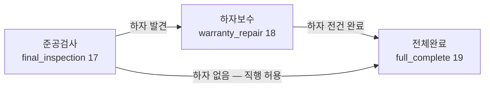

# 공정 흐름 가이드 — 대기중 + 19단계 · 하자보수 · 전체완료 (R4 확정 · R6 유지)

**현장 > 공정 보드**와 프로젝트 상세 '공정' 탭이 따르는 공정 운영 기준 문서입니다.
공정 상태의 단일 원천은 `projects.process_stage_id` 이고, 모든 이동은 `ProcessService::moveStage()` 를 경유합니다(직접 UPDATE 금지 — R3 커널 규약).
화면 사용법은 [USER_MANUAL 8·9번](USER_MANUAL.md#8-공정-보드-대기중-등록-확인), 요약은 [PRODUCT_MANUAL 11·12번](PRODUCT_MANUAL.md#11-공정-보드--대기중--19단계) 참조.

> **R6 RC 검수(2026-07-23) — 대기중+19단계·하자보수·전체완료 게이트 변경 없음(유지 확인).** CRM 흐름 E2E 검수(T7)에서
> 계약 진행 → 프로젝트 자동생성 → 공정 대기중(waiting, is_auto=1) → 공정 이동(진행률 자동) → 전체완료 게이트(경고 4항목 → 예외 사유 진행·이력 기록) →
> 하자보수 → 정산(공정 이동 400 차단) 전 단계를 실측 통과. 근거: `.superpowers/sdd/r6-crmqa-report.md` §1(65/65 PASS).

## 1. 공정 구조 — '대기중 + 19단계' (보드 컬럼 20개)

| 그룹(보드 묶음) | sort | 단계 (화면명 / stage_key) | 비고 |
|---|---|---|---|
| 대기중 | 0 | 대기중 / waiting | 착공 전 대기 — 계약 '진행' 전환 시 자동 배치 |
| 착공 준비 | 1~4 | 현장실측 site_survey · 도면작성 drawing · 자재발주 material_order · 착공준비 prep | |
| 시공 | 5~15 | 양생/보양 protection · 고압세척 pressure_wash · 바탕처리(면처리) surface_prep · 크랙보수 crack_repair🔒 · 퍼티/퍼팅 putty · 방수처리 waterproofing🔒 · 프라이머 primer · 1차도장 paint_1st · 2차도장 paint_2nd · 3차도장(마감) paint_3rd🔒 · 건조양생 drying | |
| 마무리 | 16~17 | 현장정리 site_cleanup · 준공검사 final_inspection🔒 | |
| 하자보수 | 18 | 하자보수 warranty_repair🔒 | |
| **종결** | **19** | **전체완료 full_complete🔒** | **R4 신설 · 전환 게이트 적용(§4)** |

- 🔒 = 확인 필요 공정(requires_confirm) — 여기에 머무는 진행 공사는 '검수 대기'로 집계됩니다(단, 전체완료는 종결 단계라 검수 대기 집계에서 제외).
- 보드 그룹은 `Stages::processGroups()` 6그룹(대기중/착공 준비/시공/마무리/하자보수/종결)이 단일 출처.
  상단 탭은 **전체 / 대기중 / 착공 준비 / 시공 / 마무리·하자** 5개 — '마무리·하자' 탭에 마무리·하자보수·종결 그룹이 함께 표시됩니다.
- 진행률은 단계의 sort 위치 기준 자동 산정(19단계 분모)이며 **전체완료 = 100%** 입니다.
- 2단계 이상 건너뛰는 이동은 "중간 공정을 건너뛰고 이동합니다. 계속하시겠습니까?" 확인이 뜹니다 —
  단 **준공검사(17)·하자보수(18) → 전체완료(19)는 권장 직행 흐름이라 이 확인을 묻지 않습니다**.

## 2. 프로젝트 '상태'와 '공정'의 분리 원칙

프로젝트에는 서로 다른 두 축이 있습니다. 혼동하지 마세요.

| 축 | 값 | 관리 위치 |
|---|---|---|
| **상태**(생애) | 8종: 진행 예정 / 진행 중 / 일시 중단 / 취소 / 파기 / 완료 / 하자보수 / 정산 완료 | 프로젝트 상세 상단 상태 전환 버튼(전이 규칙·사유·이력) |
| **공정**(시공 위치) | 대기중 + 19단계 | 공정 보드 드래그 또는 공정 탭 '공정 변경' |

- **R7 변경 — 공정 ↔ 상태 자동 연동**: 화면 집계는 3단(대기/공정/완료 — `StatusService::SIMPLE_GROUPS`, 조회시 매핑)으로 단순화했고,
  보드 이동이 상태를 자동 전환합니다.
  - 대기중에서 실공정으로 이동(공정 시작) → 상태 자동 '진행 중'(착공일 자동 기록).
  - 공정을 **전체완료(종결)** 로 옮기면 → 상태 자동 '완료'(준공일·진행률 100%·잔금 예정일 훅·이력 포함) → 대시보드 완료 즉시 증가.
  - 종결 직후 카드는 보드에서 사라지는 것이 정상입니다(완료 상태는 보드 미표시). 실수 종결은 프로젝트 상세에서 '완료 → 진행 중(사유 필수)' 전환 후 재이동.
  - 상태를 수동으로 완료했다고 공정이 옮겨지지는 않습니다(역방향 자동화 없음).
- **보드에는 진행 예정·진행 중·일시 중단·하자보수 상태만 표시**됩니다. 완료·정산·취소·파기 프로젝트는 보드에서 빠지고(데이터 보존),
  완료 공사의 공정 위치(전체완료)는 프로젝트 상세에서 확인합니다.
- 완료·정산·취소·파기된 프로젝트는 공정 이동이 차단됩니다("완료·정산·취소·파기된 프로젝트는 공정을 이동할 수 없습니다.").
- 종결된 프로젝트의 공정 값 특성(운영 참고): 취소 프로젝트는 공정 미배치(NULL)일 수 있고, 파기 프로젝트는 중단 당시 공정(예: 고압세척)에
  멈춘 채 남습니다 — 보드 미표시 대상이므로 화면 오류가 아닙니다.

## 3. 권장 흐름 — 검수 → 하자보수 → 전체완료

1. **준공검사(17)**: 현장 검수. 하자가 발견되면 프로젝트 상세 > 공정 탭에서 **하자보수 건을 등록**(§5)하고 공정을 하자보수(18)로 이동.
2. **하자보수(18)**: 건별로 내용·요청일·요청 접수자·처리 담당·처리 예정일·사진·메모·상태(접수/처리 중/완료)를 관리.
3. **전체완료(19)**: 모든 하자 처리 후 종결로 이동. 하자가 없으면 준공검사에서 직행(건너뜀 확인 없음). 이동 시 §4 게이트가 점검됩니다.
4. 이후 프로젝트 **상태**(완료/정산 완료)는 상태 전환으로 별도 처리(§2).

**주의: 전체완료에서 하자보수로 되돌리지 않습니다.** 종결 후 하자가 재발하면 하자보수 건을 추가 등록해 건 단위로 관리합니다(공정 역행 금지 정책).

## 4. 전체완료 전환 게이트 (경고 — 차단 아님)

전체완료(19)로 이동할 때 서버(`ProcessController::move`)가 아래 5개 항목을 점검합니다.

| 점검 항목 | 기준 |
|---|---|
| 미완료 하자 | `warranty_repairs` 중 status ≠ done 건수 (예: "미완료 하자 1건") |
| 미수금 | 연결 계약의 계약 총액 − 순입금(paid payment − refund) > 0 (예: "미수금 26,223,575원") |
| 확정 원가 | `costs` (type=actual, cost_status=confirmed) 0건 |
| 준공일 | `projects.actual_end_date` NULL ("준공일(실제 준공일) 미입력") |
| 최종 사진 | 프로젝트 사진(project_files, entity_type=project, image) 0건 ("최종 사진 없음") |

- **모두 충족**: 그대로 이동(추가 확인 없음 — 직행 허용).
- **미충족 항목 존재**: 항목별 경고 목록을 표시하고, **project.manage 권한자**가 확인 후 **예외 진행 사유를 입력해야** 이동합니다
  (사유 공백이면 "예외 진행 사유를 입력하세요" 오류). 사유는 공정 이력(`project_process_history.reason`)에
  `예외 완료: <사유> [미충족: …]` 형식으로 기록됩니다.
- project.manage 권한이 없으면 미충족 상태에서 예외 진행 불가(403).
- 게이트는 보드 드래그와 공정 탭 폼 양쪽에서 동일하게 동작합니다(QA 실측 검증).

운영 권장: 예외 완료는 "잔금 협의 중 종결" 같은 불가피한 경우로 한정하고, 월 점검 때 공정 이력에서 `예외 완료:` 기록을 훑어보세요.

## 5. 하자보수 건 관리 (프로젝트 상세 > 공정 탭 '하자보수' 카드)

- 목록·등록·수정·삭제: `project.manage` 권한(현장관리자·사장). 열람은 프로젝트 접근 권한(Scope) 기준.
- 카드 요약: "전체 N건 · 미완료 N건 — 미완료 하자가 있으면 '전체완료' 이동 시 경고됩니다".
- 상태: 접수(open) → 처리 중(in_progress) → 완료(done). 완료 처리 시 완료일 미입력이면 당일로 자동 기록.
- 사진은 프로젝트 파일(`project_files`, entity_type=`warranty_repair`) 재사용 — 별도 저장소 없음.
- 삭제 시 원본 전체가 감사 로그(Audit)에 보존되고 첨부 사진 파일은 물리 보존됩니다(확인 문구: "이 하자보수 건을 삭제하시겠습니까? (삭제 이력은 감사 로그에 보존됩니다)").
- API: `process.warranty.save` / `process.warranty.delete` / `process.warranty.photo` (모두 POST + CSRF).

## 6. 데이터 보정 이력 (2026-07-23 — 상세는 [MIGRATION_REPORT.md](MIGRATION_REPORT.md))

- 마이그레이션 `database/migrations/2026-07-23_r4_process19.sql`: full_complete 단계 + warranty_repairs 테이블 신설.
- 보정 스크립트 `scripts/backfill_process19.php`(dry-run 기본, `--apply` 반영): 완료·정산 프로젝트 중 준공검사(17)·하자보수(18)에 남은 건을
  전체완료로 이동(is_auto=1, reason `19단계 확장 보정`) + 진행률 100 보정. 하자보수로 되돌리는 케이스 없음(전방 이동만).
- 실행 결과: **2건 보정**(P2026-0002 · P2026-0003, 둘 다 준공검사→전체완료), 잔여 대상 0건. 취소·파기·진행 중 프로젝트는 미접촉.
